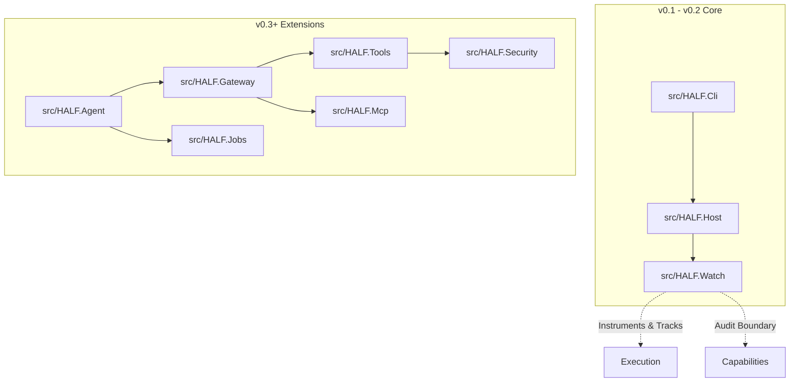

# HALF

## Humble Agentic Lightweight Framework

HALF is a lightweight framework for building useful local agents on constrained and legacy hardware (existing homelabs) through deterministic tools, retrieval, background jobs, observability, and safe execution.

The goal is practical agent systems that still work when compute is limited, deployment targets are old, or local execution matters more than scale.

HALF is built around a simple idea:

> Make the best possible use of the hardware and tools you already have.

That means using small local models where they fit, CPU when it is better, RAM and storage for retrieval and indexes, background jobs for long-running work, and observability to measure what actually helps.

## System Architecture Layout



## Current Focus
The first implementation milestone is observability around normal local model operation.
* **Ollama First:** `Ollama` is the primary initial runtime target.
* **Telemetry Core:** `HALF.Watch` owns run records, telemetry, traces, and benchmark visibility.
* **Operator Surface:** `HALF.Cli` is the entrypoint for `run`, `benchmark`, `trace`, `status`, and `optimize` workflows.
* **Target Platforms:** Docker-packaged deployment, optimizing for laptop development first and Linux VM promotion later.

## Core Rules
* **No agent run** without a run record.
* **No model benchmark** without latency, token, and resource data.
* **No optimization** without a paired before-and-after execution trace.

## Getting Started
HALF targets **.NET 10** utilizing the new `.slnx` solution format.

**Build the solution:**
```powershell
dotnet build HALF.slnx -v minimal
```

**Run the observability test surface:**
```powershell
dotnet test tests/HALF.Watch.Tests/HALF.Watch.Tests.csproj -v minimal
```

## Solution Directory
* **`src/HALF.Cli`** — Operator CLI and future command surface
* **`src/HALF.Host`** — Runtime host and service wiring boundary
* **`src/HALF.Watch`** — Run records, telemetry, traces, benchmarks, and audit surfaces
* **`src/HALF.Agent`** *(Planned)* — Bounded agent loop and orchestration layer
* **`src/HALF.Mcp`** *(Planned)* — Model Context Protocol (MCP) hosting layer for tools and resources
* **`src/HALF.Gateway`** *(Planned)* — Policy, approvals, routing, and execution gates
* **`src/HALF.Tools`** *(Planned)* — Deterministic tool implementations and registration
* **`src/HALF.Jobs`** *(Planned)* — Queued work, polling, cancellation, and job results
* **`src/HALF.Security`** *(Planned)* — Safe execution, redaction, permissions, and sandbox rules

## Documentation
Detailed specifications are kept decoupled inside the `docs/` directory:
* [Architecture Blueprint](docs/ARCHITECTURE.md) — Module boundaries and system shape
* [Phased Roadmap](docs/ROADMAP.md) — Implementation progression to v1.0
* [Telemetry Baseline](docs/TELEMETRY.md) — Telemetry schema and evidence model

## Contributing
Until the core codebase is fleshed out, contributions are best aimed at conceptual feedback on current direction, constraint validations, and implementation architectures.

## License
[MIT](LICENSE)