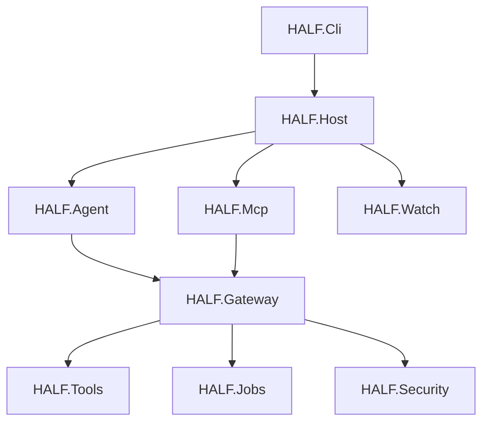

# Architecture

## Intent

HALF is structured as a set of small, explicit runtime boundaries rather than one large agent host. The goal is to keep local execution measurable, debuggable, and portable across a Windows development machine and later Linux VM deployment.

HALF should grow from measurable workflows, not from speculative complexity.

## Goals

HALF is designed to support:

- local-first agent workflows
- constrained and legacy hardware
- small model runtimes
- deterministic tools
- background jobs
- safe execution
- observable behavior
- reusable tool surfaces
- future interoperability with external agents

The framework should make it possible to run useful workflows even when:

- GPU memory is limited
- CPU is more available than GPU
- the model has a small context window
- local execution is preferred

## Overview

## Project responsibilities

### HALF.Cli

Operator entrypoint for local workflows. This project will own top-level commands, run orchestration, benchmark entrypoints, trace inspection, and future optimization workflows.

### HALF.Host

Runtime composition boundary. This project will wire together configuration, runtime adapters, policies, observability, and background services.
The host configuration contract is a typed model composed from explicit runtime, storage, and telemetry options so callers can populate one coherent source of truth without collapsing those concerns into one flat object.

### HALF.Agent

Bounded agent loop and orchestration layer. This remains intentionally shallow until the observability baseline exists.

### HALF.Mcp

Adapter surface for exposing HALF tools and resources through MCP-compatible integrations.

### HALF.Watch

Observability and evidence layer. This is the first project expected to grow real behavior and will own run records, benchmark records, traces, and audit-focused querying surfaces.

### HALF.Gateway

Execution policy boundary for routing, approvals, locks, and pre-execution checks.

### HALF.Tools

Deterministic tool registration and tool implementations.

### HALF.Jobs

Queued and background work orchestration for long-running tasks, polling, cancellation, and result retrieval.

### HALF.Security

Safe execution concerns such as redaction, permissions, and sandbox policy.

## Current scope

The initial codebase is intentionally narrowed to three active projects:

1. `HALF.Cli` for operator-facing workflows.
2. `HALF.Host` for runtime composition and integration.
3. `HALF.Watch` for run evidence, telemetry, and trace records.

This keeps the first implementation phase focused on the observability baseline instead of carrying speculative project boundaries too early.

## Initial runtime shape

The first runtime topology is:

1. `HALF.Cli` invokes local workflows.
2. `HALF.Host` composes services.
3. `HALF.Watch` records run and benchmark evidence.
4. `HALF.Host` talks to an Ollama endpoint on localhost.
5. Prometheus and Grafana consume exported metrics while JSONL traces remain the durable local record.

## Deployment assumptions

- Primary development host: Windows laptop with Docker and local Ollama.
- First durable promotion target: Linux VM in the homelab.
- Local SQLite and JSONL remain the first persistence surfaces.
- Runtime endpoints must stay configurable so localhost and LAN-hosted runtimes share the same telemetry contract.