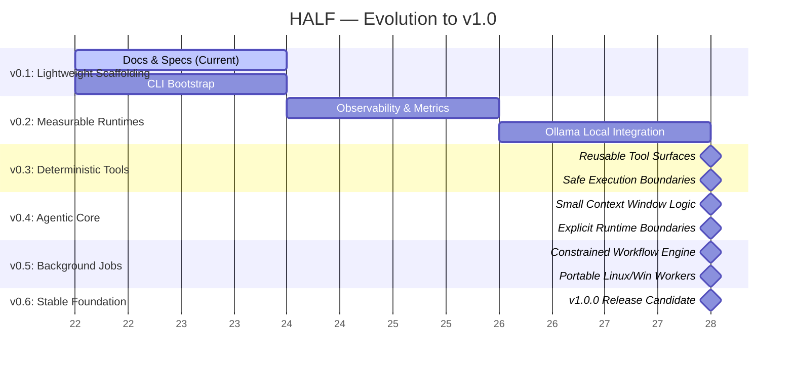

# Roadmap

## v0.1: Scaffolding
- Establish the .NET 10 solution and project structure.
- Keep the initial code shallow and explicit.
- Deliver core project structure and CLI wiring.

## v0.2: Observability-First Runtime Integration
- Add the Ollama runtime adapter.
- Introduce run records, benchmark records, and per-run traces.
- Capture latency, token usage, and resource telemetry for normal model operation.
- Expose the first CLI workflows for `run`, `benchmark`, `trace`, and `status`.

## v0.3: Tools and Gateway
- Introduce tool contracts and a lightweight tool registry.
- Add deterministic local tools for files, search, shell, and validation.
- Route tool execution through policy and observability boundaries.

## v0.4: Agentic Core
- Add the bounded agent loop in `HALF.Agent`.
- Keep deterministic orchestration in control and introduce LLM planning behind explicit execution limits.

## v0.5: Background Jobs
- Add queued background work via `HALF.Jobs`.
- Expand data retention, structured exports, and longer-lived local state.

## v0.6: Platform Growth
- Promote the stack from local laptop development to a Linux VM deployment.
- Add richer log and trace backends only when the local-first baseline is proven.

## v1.0: TBD
- Stable, production-ready working release.