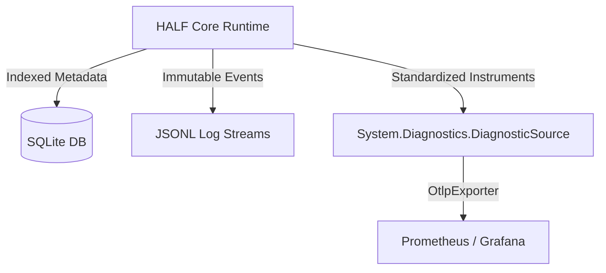

# Telemetry Framework

## v0.1 Baseline
HALF implements an evidence-first observability model. The initial milestone captures, persists, and exposes normal Ollama model operations to ensure all local execution data is immediately queryable and completely durable.

## Non-Negotiable Execution Rules
* **Guaranteed Auditability:** No agent execution occurs without emitting a structured run record.
* **Mandatory Metrics:** No model benchmark executes without capturing latency, token, and resource utilization data.
* **Data-Driven Optimization:** No code optimization or prompt adjustment is permitted without a paired before-and-after execution trace.

## Core Telemetry Envelope
Every model interaction must record and populate the following standardized schema:

| Category        | Telemetry Key           | Description                                            |
| :-------------- | :---------------------- | :----------------------------------------------------- |
| **Identity**    | `request_id`            | Unique UUID for the execution context                  |
|                 | `runtime_name`          | Underlying engine hosting the model (e.g., `ollama`)   |
|                 | `model_name`            | The exact model identifier and tag used                |
|                 | `quantization`          | Precision profile of the model layer (when available)  |
| **Performance** | `total_latency_ms`      | Complete round-trip duration                           |
|                 | `load_latency_ms`       | Time spent loading the model into memory               |
|                 | `prompt_latency_ms`     | Processing time for the input context                  |
|                 | `generation_latency_ms` | Active token generation time                           |
| **Counters**    | `prompt_tokens`         | Total input token count                                |
|                 | `completion_tokens`     | Total generated token count                            |
| **Flags**       | `is_streaming`          | Boolean indicator of streaming vs blocked response     |
|                 | `is_success`            | Boolean status of the completed execution              |
|                 | `error_category`        | Standardized failure classification string (if failed) |

## Canonical Run Record
Issue #4 establishes the implementation-facing schema for normal executions in `HALF.Watch`.
The canonical CLR model is `RunRecord`, composed from small value records so the envelope remains explicit and durable.

| Telemetry Key           | CLR Property Path            |
| :---------------------- | :--------------------------- |
| `request_id`            | `Identity.RequestId`         |
| `runtime_name`          | `Model.RuntimeName`          |
| `model_name`            | `Model.ModelName`            |
| `quantization`          | `Model.Quantization`         |
| `total_latency_ms`      | `Timing.TotalLatencyMs`      |
| `load_latency_ms`       | `Timing.LoadLatencyMs`       |
| `prompt_latency_ms`     | `Timing.PromptLatencyMs`     |
| `generation_latency_ms` | `Timing.GenerationLatencyMs` |
| `prompt_tokens`         | `Tokens.PromptTokens`        |
| `completion_tokens`     | `Tokens.CompletionTokens`    |
| `is_streaming`          | `IsStreaming`                |
| `is_success`            | `Outcome.IsSuccess`          |
| `error_category`        | `Outcome.ErrorCategory`      |

`quantization` and `error_category` remain nullable because they are conditional execution facts rather than universally available values.

## Storage & Persistence Model
Local evidence collection relies entirely on zero-infrastructure, file-based persistence to ensure rapid execution and native cross-platform portability:

* **Canonical Source of Truth:** SQLite captures indexed run, benchmark, and optimization records. JSONL trace files contain immutable, chronological per-run event streams.
* **Operational Visibility:** OpenTelemetry metrics and traces are exposed natively via standard .NET `ActivitySource` and `Meter` APIs.
* **Visualization Layer:** Local Prometheus instances scrape the metric endpoints, feeding pre-configured Grafana dashboards. Grafana and Prometheus are secondary consumer layers; they are never treated as the primary source of truth.

## Progressive Scale Path
Adhering to the principle of avoiding speculative complexity, external infrastructure dependencies are strictly deferred until operational boundaries demand them:
1. **Loki Integration:** Introduced only when searchable, aggregated log streams across detached services or hosts become mandatory.
2. **Tempo Integration:** Introduced only when distributed, cross-service trace visualization becomes operationally useful.
3. **OpenTelemetry Collector:** Introduced only after multi-service or multi-host telemetry routing and transformation rules are explicitly required.
